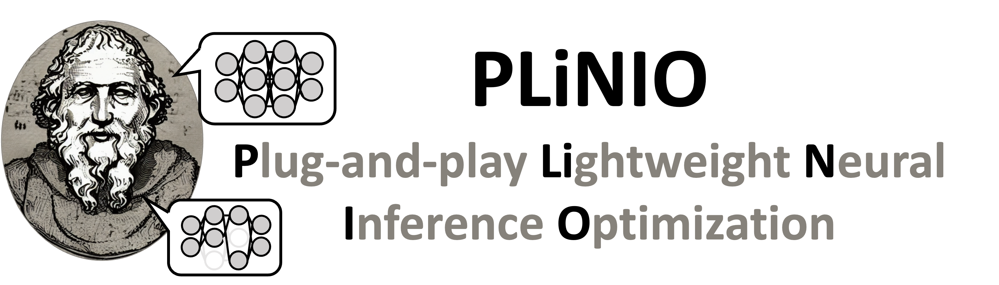
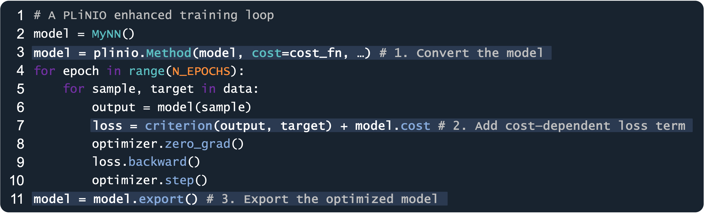

<div align="center">

</div>
<sub><sup><i>Logo partially generated with Stable Diffusion.</i></sup></sub>

---

**PLiNIO** is a Python package based on PyTorch that provides a **P**lug-and-play **Li**ghtweight tool for Deep **N**eural networks (DNNs) **I**nference **O**ptimization.
It allows you to automatically optimize a DNN architecture adding ***3 lines of code*** to your standard PyTorch training loop.

<div align="center">

</div>

PLiNIO uses *gradient-based* optimization algorithms, such as Differentiable Neural Architecture Search (DNAS) and Differentiable Mixed-Precision Search (DMPS) to keep search costs low.

## Reference

If you use PLiNIO to optimize your model, please acknowledge our paper: https://arxiv.org/abs/2307.09488 :
```
@misc{plinio,
      title={PLiNIO: A User-Friendly Library of Gradient-based Methods for Complexity-aware DNN Optimization},
      author={D. {Jahier Pagliari} and M. {Risso} and B. A. {Motetti} and A. {Burrello}},
      year={2023},
      eprint={2307.09488},
      archivePrefix={arXiv},
      primaryClass={cs.LG}
}
```

# Optimization Methods

At the current state, the following optimization strategies are supported:
- **[SuperNet](plinio/methods/supernet/README.md)**, a coarse-grained DNAS for layer selection inspired by [DARTS](https://arxiv.org/abs/1806.09055).
- **[PIT](plinio/methods/pit/README.md)**, a fine-grained DNAS for layer geometry optimization (channel pruning, filter size pruning, dilation increase).
- **[MPS](plinio/methods/mps/README.md)**, a differentiable Mixed-Precision Search algorithm which extends [EdMIPS](https://arxiv.org/abs/2004.05795) to support channel-wise precision optimization and joint pruning and MPS.

- **[ODiMO MPS](plinio/methods/odimo_mps/README.md)**, an implementation of the **One-shot Differentiable Mapping Optimizer (ODiMO)** concept, which transforms the problem of deploying a DNN onto multiple accelerators, supporting incompatible data representations, into a Differentiable MPS. More details in our [paper](https://arxiv.org/abs/2306.05060).

In the code snippet above, `Method()` should be replaced with one of the supported optimization methods' names. More information on each optimization can be found in the dedicated pages.

# Hardware Cost Models

PLiNIO focuses on **hardware-awareness** and accurate cost modeling.
Its main use case is finding DNNs that are not only accurate, but also efficient in terms of one or more cost metrics, or that respect user-defined cost constraints. Besides common hardware-independent cost metrics (n. of parameters and n. of OPs per inference), PLiNIO also provides more advanced models that account for specific HW platforms' spatial parallelism, dataflow, etc.

Both generic and HW-specific cost models are defined in the `plinio.cost` sub-package, and the library is designed to easily allow users to extend it with custom models for their hardware. More information can be found [here](plinio/cost/README.md).

# Regularizers

The simplest way to implement a cost-aware DNN optimization in PLiNIO consists in adding a cost term to the loss function of your PyTorch training loop, as shown at the top of this page. The cost term is most often multiplied times a scalar regularization strength:
```python
# before:
# loss = criterion(output, target)
# after:
loss = criterion(output, target) + reg_strength * model.cost
```
However, PLiNIO also supports more advanced regularizers, which are useful in scenarios such as:
* The necessity to co-optimize for multiple cost metrics (such as number of parameters and OPs).
* The necessity to consider cost metrics as *constraints* rather than secondary optimization objectives.

To this end, PLiNIO provides the `regularizers` sub-package, which enables this more general format:
```python
# before:
# loss = criterion(output, target)
# after:
loss = criterion(output, target) + regularizer(model)
```
More information about the available regularizers can be found [here](plinio/regularizers/README.md).


# Installation
To install the latest release (with pip):

```
$ git clone https://github.com/eml-eda/plinio
$ cd plinio
$ pip install -r requirements.txt
$ python setup.py install
```

# Example Script

TBD

# Publications based on PLiNIO

Below is a list of links to publications that either describe elements of PLiNIO, or use it to optimize DNNs for specific applications:

Main paper describing the library:

- [PLiNIO: A User-Friendly Library of Gradient-Based Methods for Complexity-Aware DNN Optimization](https://ieeexplore.ieee.org/abstract/document/10272045)

Papers on novel NAS techniques included in PLiNIO:

- [Enhancing Neural Architecture Search with Multiple Hardware Constraints for Deep Learning Model Deployment on Tiny IoT Devices](https://ieeexplore.ieee.org/abstract/document/10278089)
- [Precision-aware Latency and Energy Balancing on Multi-Accelerator Platforms for DNN Inference](https://ieeexplore.ieee.org/document/10244311)
- [Channel-wise Mixed-precision Assignment for DNN Inference on Constrained Edge Nodes](https://ieeexplore.ieee.org/abstract/document/9969373)
- [Multi-Complexity-Loss DNAS for Energy-Efficient and Memory-Constrained Deep Neural Networks](https://dl.acm.org/doi/abs/10.1145/3531437.3539720)
- [Lightweight Neural Architecture Search for Temporal Convolutional Networks at the Edge](https://ieeexplore.ieee.org/abstract/document/9782512)
- [Pruning In Time (PIT): A Lightweight Network Architecture Optimizer for Temporal Convolutional Networks](https://ieeexplore.ieee.org/abstract/document/9586187)

Usages of PLiNIO to optimize DNNs for various applications:

- [Deep Neural Network Architecture Search for Accurate Visual Pose Estimation aboard Nano-UAVs](https://ieeexplore.ieee.org/document/10160369)
- [Energy-efficient Wearable-to-Mobile Offload of ML Inference for PPG-based Heart-Rate Estimation](https://ieeexplore.ieee.org/abstract/document/10137129)
- [Embedding Temporal Convolutional Networks for Energy-efficient PPG-based Heart Rate Monitoring](https://dl.acm.org/doi/abs/10.1145/3487910)
- [Q-PPG: Energy-Efficient PPG-Based Heart Rate Monitoring on Wearable Devices](https://ieeexplore.ieee.org/abstract/document/9583926)


# License
PLiNIO entire codebase is released under [Apache License 2.0](LICENSE).
