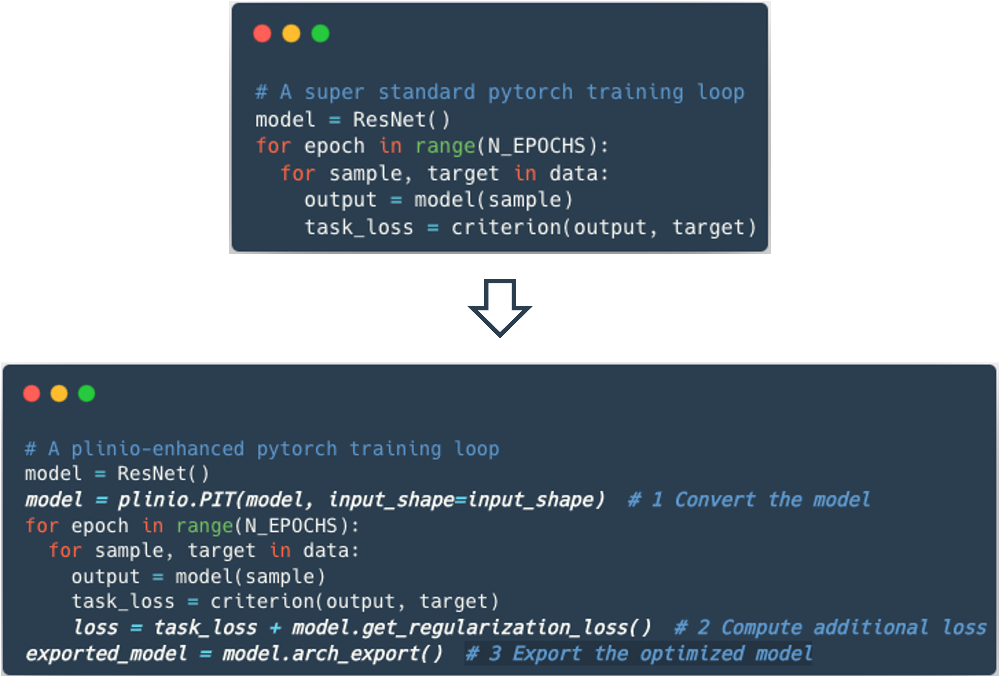

<div align="center">

</div>
<sub><sup><i>Logo partially generated with Stable Diffusion.</i></sup></sub>

---

**PLiNIO** is a Python package based on PyTorch that provides a **P**lug-and-play **Li**ghtweight tool for Deep **N**eural networks (DNNs) **I**nference **O**ptimization.
It allows you to automatically optimize a DNN architecture adding ***as few as 3 lines of code*** to your standard PyTorch training loop.

<div align="center">

</div>

PLiNIO uses *gradient-based* optimization algorithms, such as Differentiable Neural Architecture Search (DNAS) and Differentiable Mixed-Precision Search (DMPS) to keep search costs as low as possible.

## Reference

If you use PLiNIO to optimize your model, please acknowledge our work by citing our paper: https://arxiv.org/abs/2307.09488 :
```
@misc{plinio,
      title={PLiNIO: A User-Friendly Library of Gradient-based Methods for Complexity-aware DNN Optimization},
      author={D. {Jahier Pagliari} and M. {Risso} and B. A. {Motetti} and A. {Burrello}},
      year={2023},
      eprint={2307.09488},
      archivePrefix={arXiv},
      primaryClass={cs.LG}
}
```

# Optimization Methods

At the current state, the following optimization strategies are supported:
- ***[SuperNet](plinio/methods/supernet/README.md)***, a [DARTS](https://arxiv.org/abs/1806.09055)-inspired coarse-grained DNAS for layer selection.
- ***[PIT](plinio/methods/pit/README.md)***, a fine-grained DNAS for layer geometry optimization (channel pruning, filter size pruning, dilation increase).
- ***[MPS](plinio/methods/mps/README.md)***, a differentiable Mixed-Precision Search algorithm inspired by [EdMIPS](https://arxiv.org/abs/2004.05795) and extended to support channel-wise precision optimization and joint pruning and MPS.

In the figure above, `Method()` should be replaced with one of the supported optimization methods' names. More information on each optimization can be found in the dedicated page.

# Hardware Cost Models

PLiNIO focuses on **hardware-awareness** and acurate cost modeling.
Its main use case is finding DNNs that are not only accurate, but also efficient in terms of one or more cost metrics, or respect corresponding maximum-cost constraints. PLiNIO goes beyond the usual hardware-independent cost metrics (n. of parameters and n. of OPs per inference), focusing on more advanced models that account for a specific HW platform's spatial parallelism, dataflow, etc.

Both generic and HW-specific cost models are supported under the `plinio.cost` sub-package, and the library is designed to easily allow users to extend it with custom models for their hardware. More information can be found [here](plinio/cost/README.md).

# Installation
To install the latest release:

```
$ git clone https://github.com/eml-eda/plinio
$ cd plinio
$ python setup.py install
```

# License
PLiNIO entire codebase is released under [Apache License 2.0](LICENSE).
